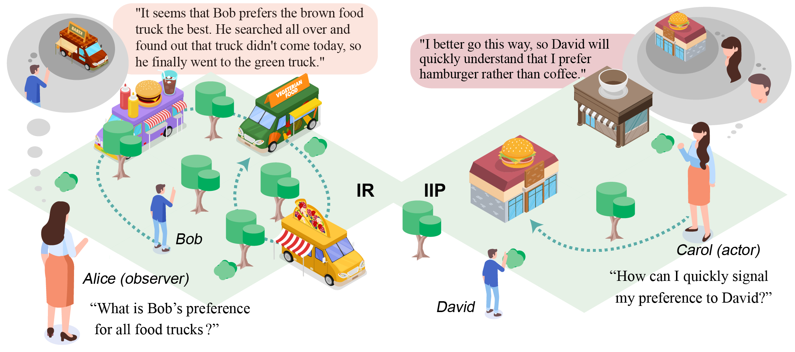
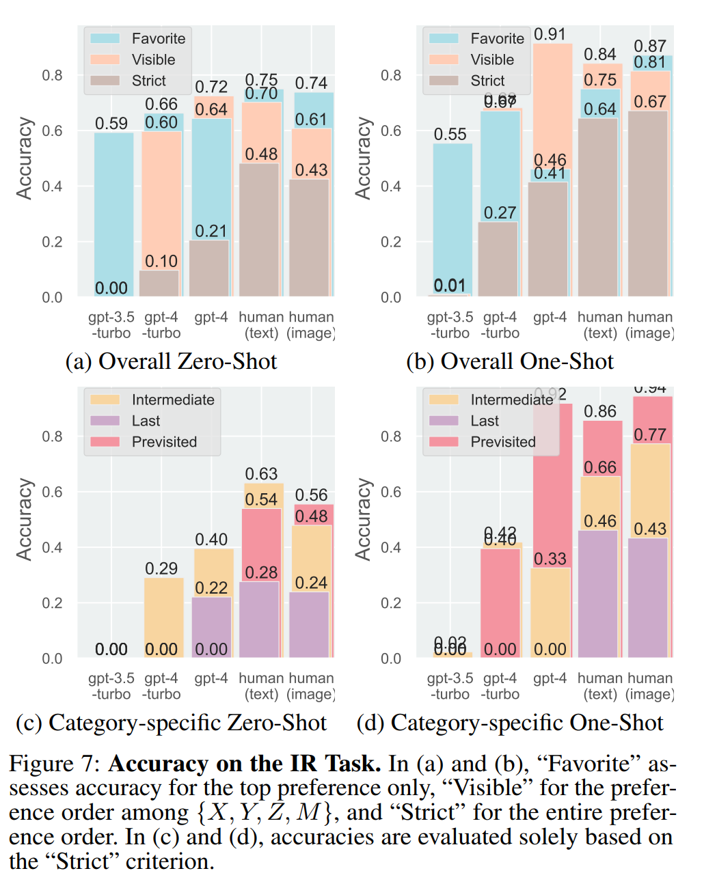
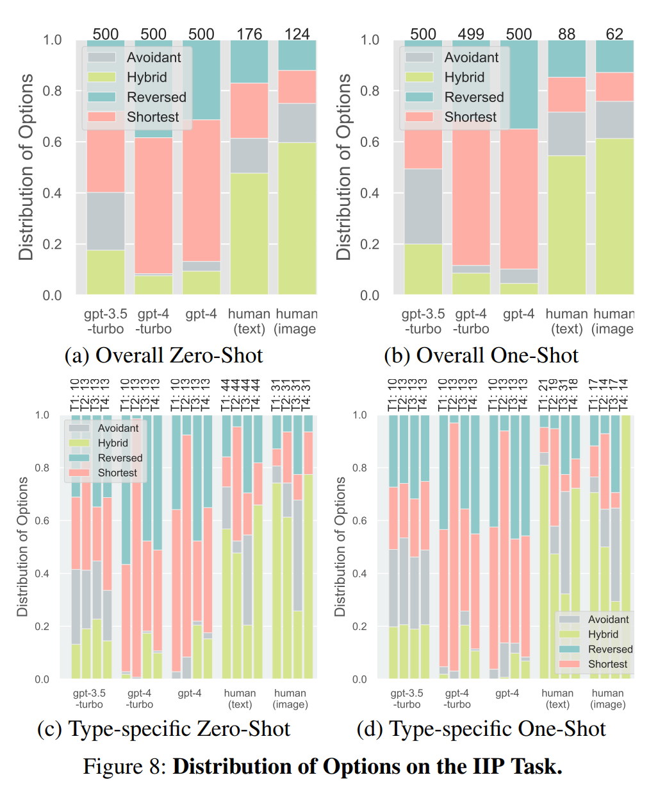

# evaluation_and_modeling_social_intelligence
code for *Evaluating and Modeling Social Intelligence: A Comparative Study of Human and AI Capabilities*


## Introduction




## Demo

https://vimeo.com/946841179?share=copy

## Generator

```
# for ir generation
python generation/food_truck_generator.py

# for iip generation
python generation/iip_generator.py
```
## Dataset

### IR

|       | Intermediate | Last | Previsited | All  |
|-------|--------------|------|------------|------|
| train | 2782         | 951  | 1192       | 4925 |
| val   | 830          | 295  | 341        | 1466 |
| test  | 283          | 86   | 118        | 487  |


### IIP

|       | I   | II  | III  | IV  |
|-------|-----|-----|------|-----|
| train | 686 | 846 | 1028 | 940 |
| val   | 213 | 244 | 281  | 262 |
| test  | 106 | 131 | 132  | 131 |

## Results




